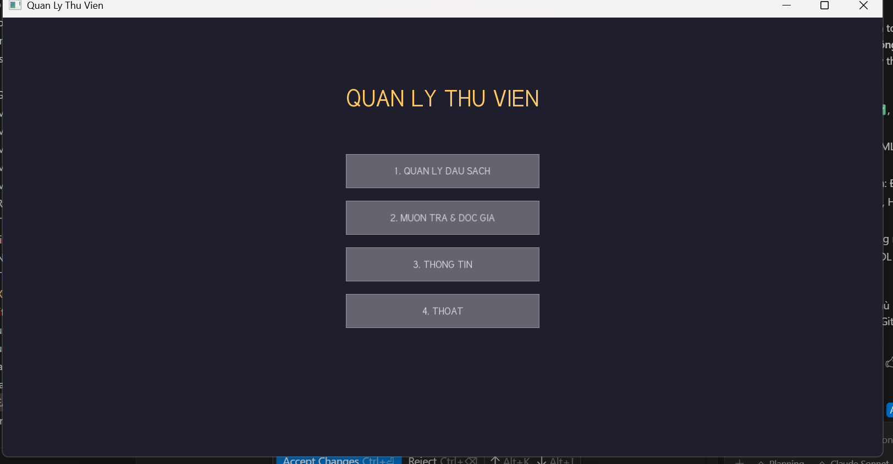
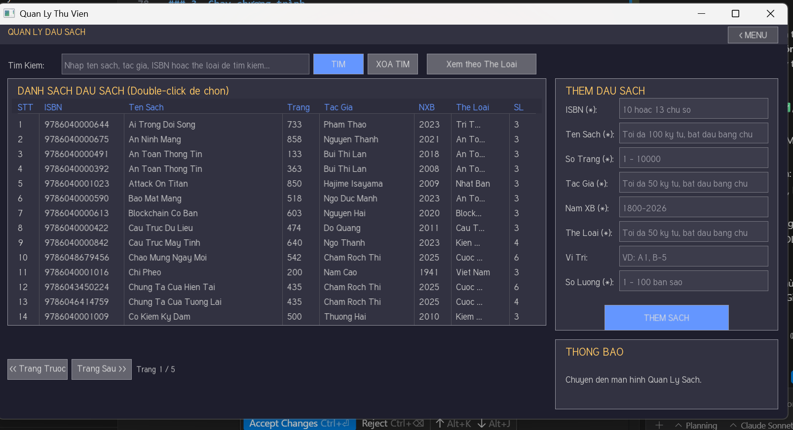
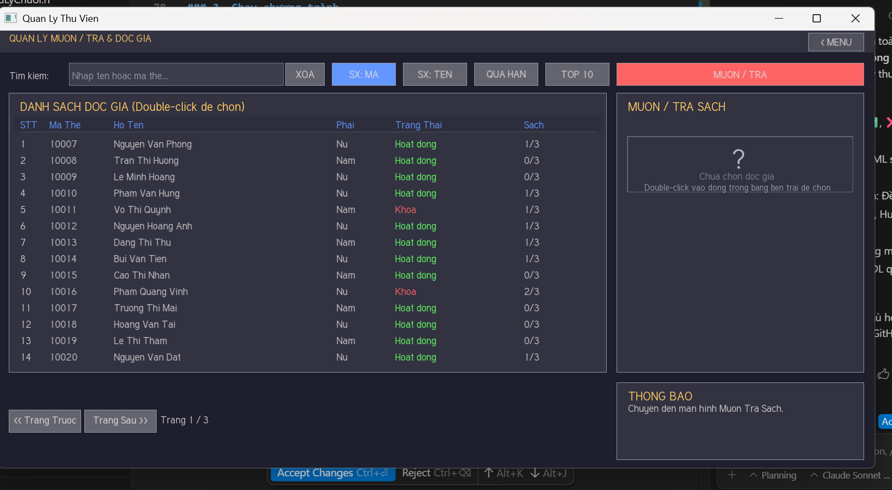
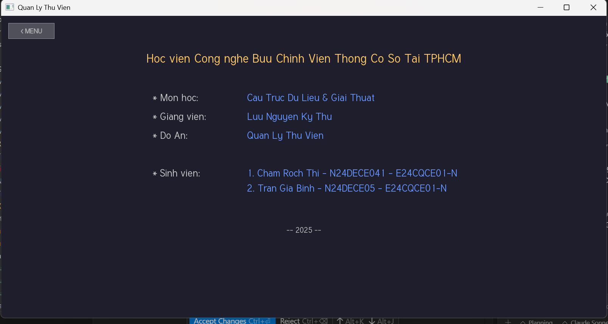

# ĐỒ ÁN CUỐI KÌ MÔN CÂU TRÚC DỮ LIỆU VÀ GIẢI THUẬT PTIT KHÓA 2024 CLC

  CHĂM RỐCH THI 
  TRẦN GIA BÌNH

# HỆ THỐNG QUẢN LÝ THƯ VIỆN

Dự án C++ đồ họa (GUI) để quản lý thư viện, được xây dựng bằng C++17, các cấu trúc dữ liệu cơ bản (Mảng con trỏ, DSLK, Cây AVL), và thư viện đồ họa SFML.

## 1. Đề bài: Tổ chức các danh sách

Đây là mục tiêu của đồ án:

- **Đầu sách:** Mảng con trỏ (danh sách tuyến tính) - Luôn sắp xếp tăng dần theo tên sách.
- **Danh mục sách:** Danh sách liên kết đơn (theo `MaSach`).
- **Thẻ độc giả:** Cây nhị phân tìm kiếm cân bằng AVL (theo `MATHE`).
- **Mượn trả:** Danh sách liên kết đơn (theo `MaSach`).

## 2. Tiến Độ Chức Năng Hiện Tại

Dự án đã được tách thành backend (logic) và frontend (UI SFML).

### Đã Hoàn Thành (Backend & UI)

- **a-b. Quản lý độc giả (Thêm, xóa, sửa, in danh sách).**
- **c. Nhập đầu sách và đánh mã sách tự động:**
- **d. In danh sách đầu sách theo thể loại:**
- **e. Tìm thông tin sách dựa vào tên sách:**
- **f-g. Xử lý mượn/trả sách.**
- **h. Liệt kê sách độc giả đang mượn.**
- **i. In danh sách độc giả quá hạn.**
- **j. Top 10 sách mượn nhiều nhất.**

## 3. Cấu Trúc Thư Mục (Đã Cập Nhật cho SFML)

Cấu trúc thư mục dự án được tổ chức theo mô hình tách biệt Giao diện (UI) và Logic (Backend):

```
LibraryManagement/
├── data/            # Mã nguồn .cpp cho logic backend (QuanLySach.cpp, ...)
├── files/           # Chứa các file dữ liệu .txt
├── include/         # Chứa tất cả các file header .h
├── utils/           # Mã nguồn .cpp cho các hàm tiện ích (XuLyChuoi.cpp, ...)
├── UI/              # Mã nguồn .cpp cho Giao diện SFML (ManHinh...)
├── lib/             # Thư mục chứa thư viện SFML
├── bin/             # Thư mục chứa file .exe đã biên dịch và font
├── .vscode/         # Cấu hình cho VS Code (tasks.json)
├── main.cpp         # Điểm vào chương trình (Khởi tạo SFML)
├── .gitignore
└── README.md
```

## 4. Yêu Cầu & Biên Dịch (SFML)

Phiên bản này yêu cầu thư viện đồ họa SFML.

- **Trình biên dịch:** MinGW-w64 g++ (Hỗ trợ C++17)
- **Thư viện:** SFML (ví dụ: 2.5.1) cho MinGW
- **Hệ điều hành:** Windows

### 1. Cài đặt SFML

- Tải SFML cho MinGW (32-bit hoặc 64-bit tùy trình biên dịch của bạn).
- Giải nén và đặt các thư mục `include`, `lib` của SFML vào trong thư mục `/lib/SFML` của dự án (hoặc một vị trí khác và cập nhật đường dẫn biên dịch).

### 2. Biên dịch (Lệnh khuyên dùng)

Mở terminal tại thư mục gốc `LibraryManagement` và chạy lệnh sau:

```bash
g++ -std=c++17 -Wall -Wextra -Iinclude -Ilib/SFML/include -g main.cpp UI/*.cpp data/*.cpp utils/*.cpp -Llib/SFML/lib -lsfml-graphics -lsfml-window -lsfml-system -o bin/main.exe
```

**Giải thích lệnh:**

- `g++ ... -g`: Gọi trình biên dịch với cờ debug.
- `main.cpp UI/*.cpp data/*.cpp utils/*.cpp`: Gom tất cả các file mã nguồn `.cpp` cần thiết (UI, data, utils).
- `-Iinclude -Ilib/SFML/include`: Chỉ dẫn trình biên dịch tìm file header (`.h`) trong thư mục `include/` và `lib/SFML/include/`.
- `-Llib/SFML/lib`: Chỉ dẫn linker tìm file thư viện (`.a`) trong thư mục `lib/SFML/lib/`.
- `-lsfml-graphics -lsfml-window -lsfml-system`: (Quan trọng) Liên kết với các module SFML cần thiết.
- `-o bin/main.exe`: Tạo file thực thi tên là `main.exe` trong thư mục `bin/`.

### 3. Chạy chương trình

Sau khi biên dịch thành công:

```bash
.\bin\main.exe
```

Lưu ý: Cần sao chép file font (ví dụ: `DejaVuSans.ttf`) vào thư mục `bin/` để chương trình có thể tải font và chạy.

## 5. Hướng Dẫn Sử Dụng Giao Diện

### Màn Hình Chính (Menu)

- **1. QUAN LY DAU SACH:** Đi đến màn hình quản lý sách.
- **2 Độc Giả và Mượn Trả.
- **3. THONG TIN:** Xem thông tin đồ án.
- **4. THOAT:** Thoát chương trình (sẽ tự động lưu nếu có thay đổi).




